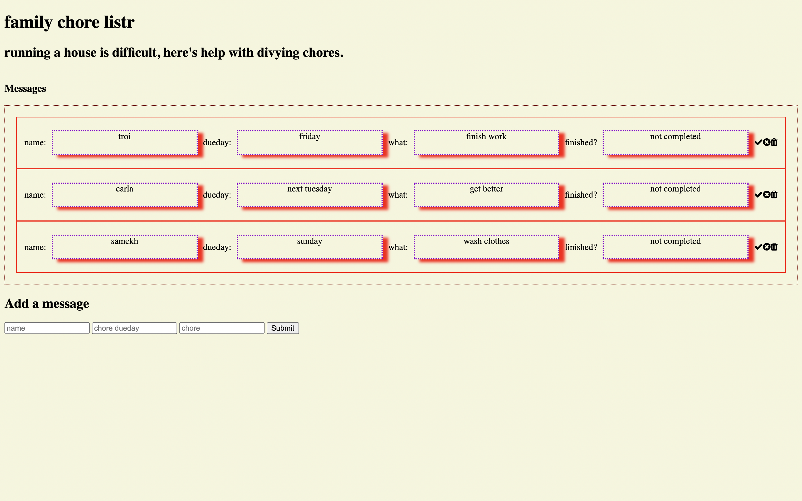

# Family Chore Listr

**link to project**

### How It’s Made
Using basic crud functionality, required packages, and the mongoDB database. 

<b>Langs used</b>

Javascript, HTML5, CSS3, express.js and node.js

### optimizations

Css could be optimized better. Thinking of adding a good or bad feature, when you click the check it turns the background green to let it be known that the chore was done well, red for not so done well, and I’m thinking about adding a page that shows the chores of a person by name. So if Troi wanted to see what she only had to do and the list of chores was long among other individuals, she could just click the “see only my chores” list to see what she needed to complete for the day		

### Lessons Learned

How to use information in the mongo database, creating a function that adds different selectors
